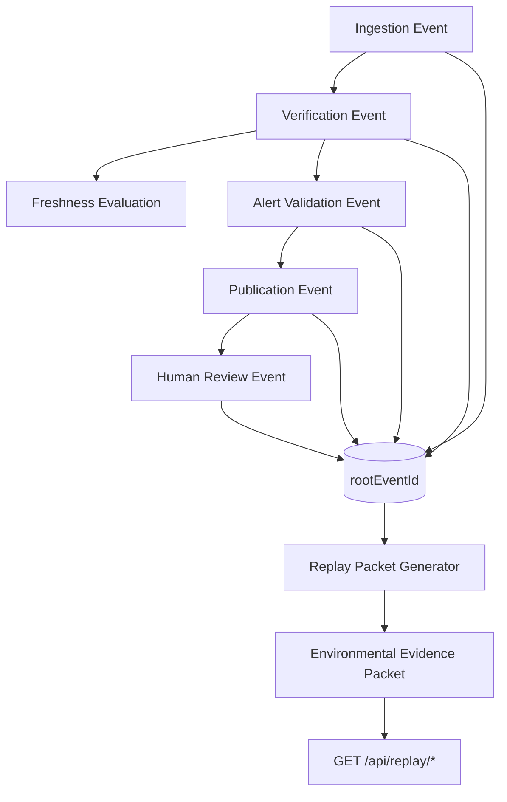

# HutchStack Environmental Replay Engine

Phase 2 of the Environmental Intelligence Harness transforms auditable events into **fully replayable** environmental evidence. Any signal, alert, or harness event can be reconstructed from persisted records alone — no external logs required.

---

## Architecture



### Persistence

All lineage is stored in `environmental_harness_events`:

| Column | Purpose |
|--------|---------|
| `id` | Deterministic event ID (`EHE-{kind}-{hash}`) |
| `event_kind` | Raw harness kind (ingestion, verification, …) |
| `event_type` | Lineage type (ingestion, verification, alert, review, publication) |
| `parent_event_id` | Previous step in chain |
| `root_event_id` | Chain anchor (typically ingestion root) |
| `signal_id` | Deterministic signal scope (`SIG-{hash}`) |
| `alert_id` | Operational alert identifier |
| `payload_json` | Immutable event payload |
| `content_hash` | Stable SHA-256 of payload |

Migration: `apps/api/src/db/migrations/0003_environmental_harness_lineage.sql`

---

## Event graph

Expected chain:

```
ingestion
  ↓
verification (+ optional freshness)
  ↓
alert validation
  ↓
publication
  ↓
human review
```

Each node exposes:

```typescript
{
  eventId: string;
  parentEventId: string | null;
  rootEventId: string;
  eventType: "ingestion" | "verification" | "alert" | "review" | "publication";
  createdAt: string;
  outcome?: HarnessOutcome;
}
```

### Signal IDs

Deterministic signal scope:

```
SIG-{sha256(source|station|observedAt|provenanceId)[0:16]}
```

Used to correlate ingestion, verification, alerts, and review for the same environmental signal.

---

## Replay process

1. **Resolve entry point** — by `signalId`, `alertId`, or `eventId`
2. **Load lineage chain** — all events sharing `root_event_id`, ordered by `created_at`
3. **Extract persisted payloads** — ingestion, verification, alert, review, publication
4. **Rebuild freshness** — from persisted observation/product timestamps only (never inferred provenance)
5. **Assemble replay packet** — deterministic `packetId` from lineage + identifiers
6. **Wrap evidence packet** — adds `generatedAt`, provenance envelope, withheld section index

### Replay packet schema

See `packages/shared/src/harness-replay.ts`:

- `lineage` — ordered chain nodes
- `sourceInputs` — persisted ingestion/provenance payload or `withheld`
- `freshnessEvaluation` — persisted freshness event or recomputed from persisted timestamps
- `verificationResults` — verification + freshness events
- `alertDecisions` — alert validation events
- `reviewActions` — human review events
- `publicationOutcome` — publication event or withheld
- `evidenceStatus` — `complete` | `partial` | `withheld`
- `withheldSections` — explicit list of missing evidence

### Environmental evidence packet

Single export artifact explaining **why** a signal exists:

```typescript
EnvironmentalEvidencePacket {
  packetId;          // EVP-{hash}
  generatedAt;       // export time (not in hash)
  rootEventId;
  signalId?;
  alertId?;
  provenance;
  lineage;
  verification;
  reviewHistory;
  publicationDecision;
  replay;            // full replay packet
  evidenceStatus;
  withheldSections;
}
```

---

## API endpoints

| Endpoint | Description |
|----------|-------------|
| `GET /api/replay/signal/:id` | Replay by deterministic signal ID |
| `GET /api/replay/alert/:id` | Replay by operational alert ID |
| `GET /api/replay/event/:id` | Replay from any harness event ID |

**Access:** requires `OPERATOR_ACCESS_TOKEN` (same as `/internal/lineage`).

**Fail-closed behavior:**

- `404` when no persisted events exist
- `503` when storage unavailable
- Response includes `withheld_sections` — never synthesizes missing evidence
- `packet: null` when evidence cannot be reconstructed

---

## Failure modes

| Condition | Behavior |
|-----------|----------|
| No ingestion event | `sourceInputs` withheld → `evidenceStatus: withheld` |
| Missing verification | `verificationResults` unavailable, partial evidence |
| Alert gate rejected | No publication event; publication withheld |
| No review recorded | `reviewActions` unavailable, partial evidence |
| Provenance not persisted | Source inputs withheld; no synthetic fill |
| Pre-lineage events (legacy) | Partial chain; missing parent/root marked withheld |

---

## Determinism rules

- Event IDs: hash of `(eventKind, subjectType, subjectId, contentHash)`
- Signal IDs: hash of source identity fields (no timestamps in hash unless part of identity)
- Replay packet IDs: hash of `(rootEventId, signalId, alertId, sorted lineageEventIds)`
- Evidence packet IDs: hash of `(replayPacketId, rootEventId)`
- **`generatedAt` is never part of content hashes**

---

## Implementation map

| Component | Path |
|-----------|------|
| Shared schemas | `packages/shared/src/harness-replay.ts` |
| Lineage helpers | `apps/api/src/services/environmental-harness/lineage.ts` |
| Replay engine | `apps/api/src/services/environmental-harness/replay.ts` |
| Audit chaining | `apps/api/src/services/environmental-harness/audit.ts` |
| Event repository | `apps/api/src/repositories/environmental-harness-events.ts` |
| API routes | `apps/api/src/routes/replay.ts` |
| Tests | `apps/api/src/services/environmental-harness-replay.test.ts` |

---

## Example replay flow

After a successful NDBC ingest → alert → publication → review:

```
GET /api/replay/signal/SIG-a1b2c3d4e5f67890?token=...
```

Returns `EnvironmentalEvidencePacket` with:

- Full lineage chain (5 nodes)
- Ingestion source inputs from persisted payload
- Freshness evaluation (`live`, policy band `pass`)
- Verification outcome (`pass`)
- Alert validation (`published`)
- Publication decision (`published`)
- Review action (`attach_outcome`)

If any step was never persisted, the packet is returned with `evidenceStatus: "partial"` and explicit `withheldSections`.
